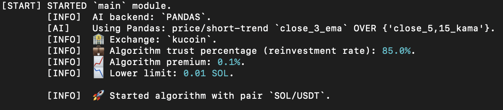
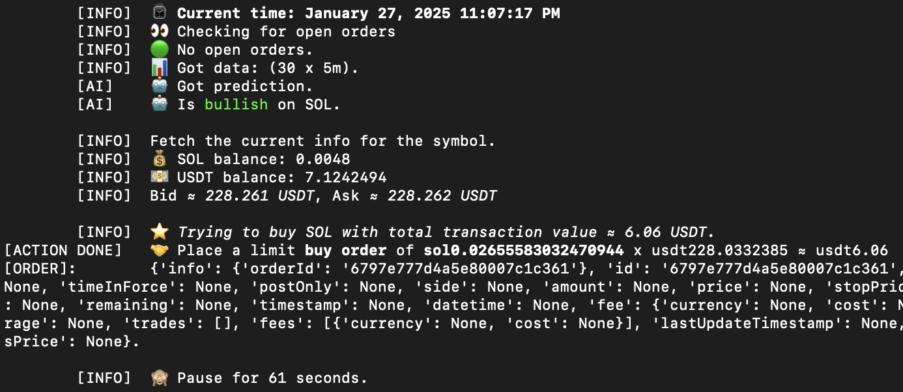
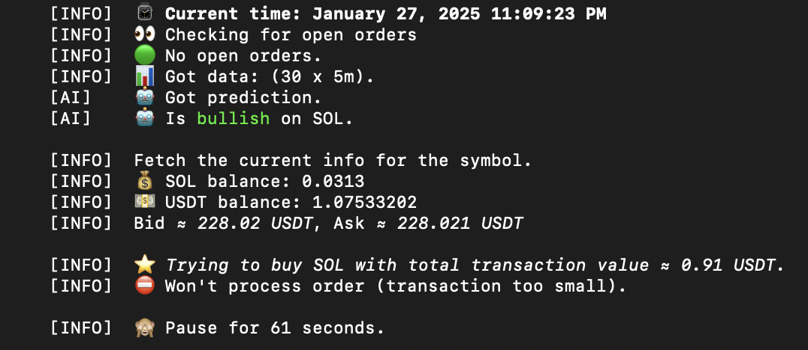
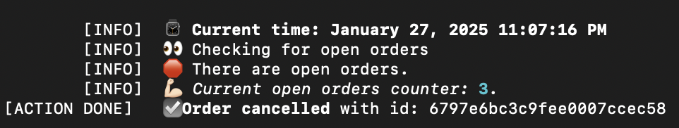
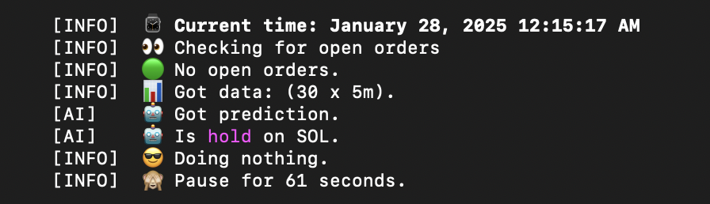

#### Disclaimer:

*Usage of this software in its current form will ***likely result in loss of funds***.*

*For all intents and purposes, this software is to be considered an educational example.*

*See [LICENSE](LICENSE) for more clarification. And do read this README carefully.*

# Crypto Autotrader
 © Stan

    

This software is capable of fully autonomous trading on popular cryptocurrency exchanges, once set up correctly.

Currently, it utilizes several naive approaches to spot trading (either [price-related crossovers](https://trendspider.com/learning-center/moving-average-crossover-strategies/) or GPT-powered analytics is an option); however, due to it being highly customizable, one could squeeze better results out of it.

This software is open source under a permissive [License](LICENSE), and it's FREE.

*Support for older Python versions is not guaranteed, but deemed probable for 3.10 and newer.*

*Console only app (no GUI, but user-friendly messages).*


## Features

 * This script endlessly places buy and sell orders based on predictive modeling (with 'smart' calculations of price and amount, see function `prepare_order` of class `App` in module [run.py](run.py)):

   a. Price for 'BUY' orders is `((bid + ask) / 2) * (1 - parametrized premium)`,

   b. Price for 'SELL' orders is `((bid + ask) / 2) * (1 + parametrized premium)`,

   c. Amount to buy is `parametrized reinvestment_rate x free quote token balance / price buy`

   d. Amount to sell is `parametrized reinvestment_rate x free base token balance`

 * This software operates under the assumptions that one can only use one's own capital

 * This software uses default Python floating point real numbers (`float`)

 * This software is shipped with substantial error handling. The script is designed to run indefinitely.

 * Available time frames (specified by item from left column, not guaranteed for every exchange):
```
'1m': '1min'
'3m': '3min'
'5m': '5min'
'15m': '15min'
'30m': '30min'
'1h': '1hour'
'2h': '2hour'
'4h': '4hour'
'6h': '6hour'
'8h': '8hour'
'12h': '12hour'
'1d': '1day'
'1w': '1week'
```


## Environment Variables

To run this project, one would need to add the following environment variables to the `.env` file/-s (the currently programmed logic is in two separate files for predictive and running modules, but it doesn't have to be).

All fields must be filled with valid strings. Fields that end with '_JSON' must be filled with valid json data strings.
`.env` files must be linked in the starting sequence part (`if __name__ == "__main__":`...) of the [`run.py`](run.py) script.

### Running module variables
*(easier to create a new `main.env` as per [example](main.env.example), that has included explanations for each variable, as well)*

`EXCHANGE_API_KEY` – API to access cryptoexchange

`EXCHANGE_SECRET` – API to access cryptoexchange

`EXCHANGE_PASSPHRASE` – API to access cryptoexchange

`ALGORITHM_TRUST_PERCENTAGE` – Reinvestment rate – how much of one's free balance (per token) is to be used for spot orders (*default is 0.5, can be a real value in range [0.0;1.0]*)

`BASE_SLEEP_TIME` – sleep time in seconds between program cycles

`CANCEL_ORDER_LIMIT` – how many cycles to wait before cancelling all open orders (cancels orders on achieving LIMIT)

`RETRIES_BEFORE_SLEEP_LIMIT` – how many times to retry without sleeping (only unknown errors)

`DATA_VECTOR_LENGTH` – Number of past-data points to use in predictive modeling

`DEFAULT_EXCHANGE_NAME` – ccxt supported exchange name

`DEFAULT_EXCHANGE_FEE` – price fraction that is collected as order fee by crypto exchange

`PREMIUM_OVER_EXCHANGE_FEES` – any positive real number (would be kept at 0.0, to only account for exchange fee without additional premium/discount on bid/ask)

`MIN_TRANSACTION_VALUE_IN_BASE` – Minimal amount to spot-order base currency for a given trading pair

`TIMEFRAME` – Depending on cryptoexchange, this value can be set as either of: `1m`, `3m`, `5m`, `10m`, `15m`, `30m`, `4h`, `8h`, `12h`, `1w`. See ccxt docs or exchange API for correct info.

`TRADING_PAIR` – What to spot trade (e. g., `XMR/USDT`). NOTE: One must have both of these two tokens in any amount in their portfolio, before an order can be placed (If that isn't the case, the script will show a `ProbablyAIButCouldBeAnything` exception with the ticker of the token one doesn't own).

### Predictive module variables
*(easier to create a new `predictions.env` or `pandas.env` as per [example 1](predictions.env.example) or [example 2](pandas.env.example), that have included explanations for each variable, as well)*


`DEFAULT_PREDICTION_API` – either `GROQ` or `PANDAS` is supported

#### Case 1
If `DEFAULT_PREDICTION_API=PANDAS`, then:

`PREDICTION_OPERATIONAL_PRICE_TYPE` – stockstats.StockDataFrame supported indicator or price type (e.g., `middle_2_sma` or `close`). Numbers cannot exceed `DATA_VECTOR_LENGTH`.

`PREDICTION_INDICATORS_JSON` – valid json array of stockstats.StockDataFrame supported indicators (e.g., `["close_5,15_kama","middle_15_ema"]`). Numbers cannot exceed `DATA_VECTOR_LENGTH`.

`PREDICTION_GLOBAL_SIGNAL_LAG` – integer value of 1 or greater (cannot exceed `DATA_VECTOR_LENGTH`). Currently, the usage of a lagged crossover is hardcoded as per the vision of the developer; however, altering that is very achievable: updated can be the `predict_pandas` function in module `predict.py` – specifically, the way that lists `signals` and `anti_signals` are filled. The part `{"_delta" * self.wait_for_n_signal_lags}` just needs to be eliminated, as do any subsequent mentions of `self.wait_for_n_signal_lags`.

#### Case 2
If `DEFAULT_PREDICTION_API=GROQ`, then:

`GROQ_API_KEY` – api key to access GROQ

`GROQ_MODEL` – GROQ API supported model name (e.g., `llama-3.3-70b-versatile`)


## Deployment
*Steps 3 and 4 are irrelevant, if [.Dockerfile](.Dockerfile) is used*

#### 1
Create `.env` file/-s:

Parametrization of this software is achieved via the means of environment variables, specifically through the use of `.env` **files**. So the files are essential.

#### 2

Link these `.env` files in [Python module run.py](run.py) in the `if __name__ == "__main__":` section as  `PREDICTION_ENVIRONMENT_FILENAME` and `MAIN_ENVIRONMENT_FILENAME` constants. They don't *have* to be separate files, but at least **a** filename must be supplied of a file containing the required Environment variables.
Not specifying a `<something>.env` file would result in scanning the literal file with the path '.env' in the same directory as the script.

### Unix operating systems (GNU/Linux, macOS, ...)

#### 3

The required packages are installed with:

    pip install --root-user-action=ignore --upgrade pip && pip install --root-user-action=ignore -r requirements.txt


#### 4

Run from inside project directory:

    python3 run.py

Alternatively run from outside project directory (change `<path_to_`run.py`>` to actual path):

    sudo python3 <path_to_`run.py`>

*Administrator password might be prompted to enter*

### Windows

Untested. Windows users must be smart enough to figure out the quirks.

### Docker

Untested, but flawless deployment is probable. The [.Dockerfile](.Dockerfile) is shipped with essential commands.
## License

[MIT LICENSE](LICENSE)


## Authors

- Stan [@FunnyRabbitIsAHabbit](https://www.github.com/funnyrabbitisahabbit)


## 🚀 About Me

I'm a Full Stack Software Engineer, specializing in all things Python. I code a lot, I don't publish my code a lot. I also happen to be a domain expert in Business, Economics & Finance, holding both M.Sc. & B.Sc. degrees in relevant fields of study.

I might be available for hire at a random time. Reach out with offers via email stevietfg+joboffer@gmail.com.

If you'd like to support my endeavors (or my lifestyle, in general), in accordance with the nature and character of this software, I accept donations in one truly CRYPTO currency – [Monero (XMR)](https://www.getmonero.org) at addresses: 

 * `4BDMZQaXRYMUE8PBBddmPRTEV4TSQ4ecpY8u7ZKCRFT6DTKCjJsqCzi7st5XWa47CTAad5mXemkFoJnjW16of7GwPpgtsnB`

Monero is also the default crypto for this **Crypto Autotrader** to spot-trade.

## Support

For support & troubleshooting, email stevietfg+tradingbotsupport@gmail.com (with Subject: `[AUTOTRADER SUPPORT]`).

*Any attention that I offer to the sender, I do at my own discretion; any sender would be respectful of my time.*

This repository can be forked and made the needed changes with, in such case that I don't respond.

## Feedback & Ideas

For new ideas, issues can be opened, but appreciated are emails at stevietfg+tradingbotideas@gmail.com (with Subject: `[AUTOTRADER IDEAS]`)


## Acknowledgements

This software is heavily reliant on the following masterpieces of programming:

 * [ccxt library](https://github.com/ccxt/ccxt) with their [LICENSE](https://github.com/groq/groq-python/blob/main/LICENSE) (to date: Jan 27, 2025)
 * [Pandas library](https://pandas.pydata.org) with their [LICENSE](https://github.com/pandas-dev/pandas/blob/main/LICENSE) (to date: Jan 27, 2025)
 * [NumPy library](https://numpy.org) with their [LICENSE](https://github.com/numpy/numpy/blob/main/LICENSE.txt) (to date: Jan 27, 2025)
 * [stockstats library](https://github.com/jealous/stockstats) with their [LICENSE](https://github.com/jealous/stockstats/blob/master/LICENSE.txt) (to date: Jan 27, 2025)
 * [groq library](https://github.com/groq/groq-python) with their [LICENSE](https://github.com/groq/groq-python/blob/main/LICENSE) (to date: Jan 27, 2025)


## Appendix

As is known, any trading system that utilizes Technical analysis techniques would be better off in markets with high liquidity. With regard to this, it would be wise to pick trading pairs that are high in trading volume.

However, other reasons can be considered; thus making the liquidity-related suggestion moot.

[This absolute unit of a Jupyter Notebook](test_xmrusdt.ipynb) is my gift to the noob Technical analysis enthusiasts.
It can help them backtest their crossover strategies AND the code happens to be very compatible with this **Crypto Autotrader**.

See my relevant affiliate links:
 * [Rent a VPS/VDS worldwide, pay in crypto!](https://my.bluevps.com/aff.php?aff=684)
 * [Crypto processing services for persons and businesses](https://account.nowpayments.io/create-account?link_id=3477503345)


## Screenshots

The software sends user-appealing info messages to the console.

   

   

   

   

   

